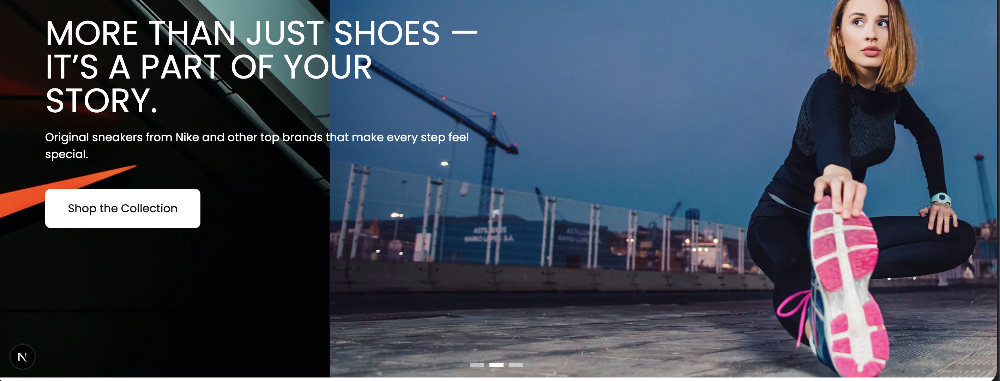
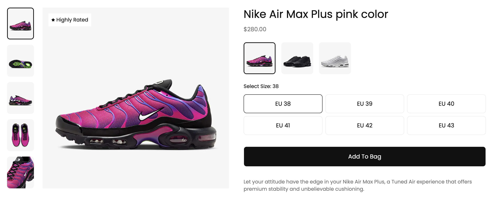
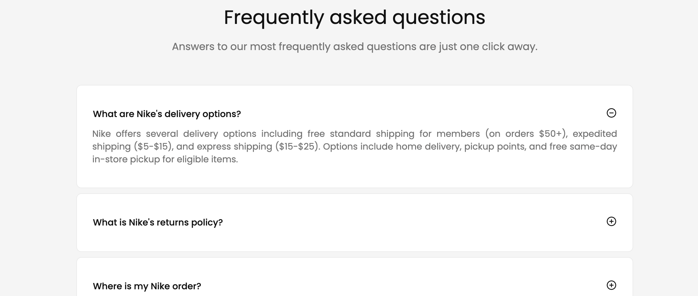

# Stellar Sneakers

A high-performance, fully responsive e-commerce platform designed specifically for premium footwear retail. This storefront features immersive media sliders, advanced sneaker configurators with live state handling, and interactive conversion-focused marketing elements.

  

  
  

## Core Features

- **Multi-Link Header:** A sleek navigation bar featuring the brand logo, targeted sneaker category menus (New & Featured, Men, Women, Kids), and an accessible quick-view shopping cart gateway.
- **Hero Billboard Slider:** An immersive, touch-optimized Swiper.js carousel showcasing headline drops with custom text overlays, action triggers ("Shop the Collection"), and stylized pagination bullets.
- **Responsive Product Carousel:** A fluid footwear showcase powered by Swiper.js that dynamically scales item cards based on viewports with integrated navigation arrows.
- **Interactive FAQ Accordion:** A clean, stylish disclosure system built for frictionless reading and smooth expansion of common shipping, sizing, and return questions.
- **Advanced Product Spotlight:** A high-end sneaker configurator with live state synchronizations. Switching options instantly updates the master footwear image, pricing matrix, active colorway, and sizing grid, while holding a persistent "Highly Rated" quality badge.
- **Smart Promo Popup:** An attention-grabbing promotional modal programmed to trigger exactly 1 second post-load to capture leads, featuring instant dismiss actions via close anchors or email submission triggers.

## Tech Stack

- **Frontend:** Next.js (App Router), React, TypeScript.
- **Styling:** Tailwind CSS (Responsive Utilities & Grid Systems).
- **Slider Engine:** Swiper.js (Touch Events & Breakpoints Control).
- **State & Logic:** Local React Hooks (useState, useEffect) for instantaneous UI state changes.
- **Iconography:** lucide-react.
